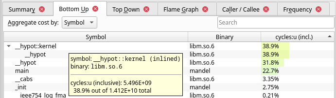

Dans cette correction, je rentre en détail dans chaque aspect des questions.
Il n'est pas attendu que vous en fassiez autant dans le contexte d'un TP ;
je veux en outre vous donner un aperçu de ce qu'on peut découvrir en analysant un code,
si tant est qu'on prend le temps de maîtriser de l'outillage et qu'on fait preuve
de curiosité.

# Exercice 0 : prise en main du profileur

> - Mettez-vous à l'aise avec plusieurs profileurs :
> 
>   + [_perf_(1)](https://man.archlinux.org/man/perf.1)
>     (avec `perf record -g`),
> 
>   + ainsi que [Callgrind](https://valgrind.org/docs/manual/cl-manual.html)
>     (avec `valgrind --tool=callgrind`).

J'utilise deux machines pour faire ces tests :

- Un ordinateur fixe avec CPU x86-64 AMD 3700X
  (8 cœurs [hyperthreadés](https://fr.wikipedia.org/wiki/Hyper-threading))
  sous Arch Linux.

  Il me suffit d'installer *perf* avec :

  ```sh
  sudo pacman -S perf
  ```

- Un ordinateur portable avec CPU x86-64 Intel i5-10310U
  (4 cœurs hyperthreadés) sous Windows 11 avec WSL2,
  sur lequel j'utilise la distribution Debian fournie automatiquement.

  Pour installer *perf*, je dois également installer un paquet avec
  des informations sur le noyau :

  ```sh
  sudo apt install perf linux-perf
  ```

Sur mon système, la configuration initiale me permet d'utiliser *perf*
sans être super-utilisateur ni modifier de fichiers de configuration.
Selon la distribution utilisée, il convient d'effectuer une commande *sysctl*
ou bien de modifier un fichier de configuration pour désactiver des mesures de sécurité
mises en place par défaut.

Pour *Callgrind*, je peux utiliser Valgrind que j'ai installé ainsi :

```sh
sudo pacman -S valgrind   # Arch
sudo apt install valgrind # Debian
```

Valgrind n'interagit pas avec le noyau, et on peut l'utiliser sans configuration particulière.

> - Analysez les profils à l'aide de leur outils correspondants :
> 
>   + `perf report`,
> 
>   + [Hotspot](https://github.com/KDAB/hotspot),
> 
>   + ou bien [KCacheGrind](https://kcachegrind.github.io)

Sur Arch Linux, je peux installer Hotspot-1.5.1 avec l'AUR :

```sh
yay -S hotspot # Arch Linux, 1.5.1
```

Je peux installer Hotspot-1.3.0 avec les repos par défaut de Debian Bookworm :

```sh
sudo apt install hostpot # Debian, 1.3.0
```

Mais pour avoir la dernière version sans avoir à compiler contre QT5,
je peux également utiliser l'application distribuée en
[AppImage](https://en.wikipedia.org/wiki/AppImage)
sur la page *Release* du projet : [hotspot-v1.5.1-x86\_64.AppImage][0].
La seule dépendance qui risque de manquer pour le AppImage
est libfuse2.

[0]: https://github.com/KDAB/hotspot/releases/download/v1.5.1/hotspot-v1.5.1-x86_64.AppImage

> 1. Écrivez un "Hello World" en C et en C++.
>    Profilez leurs compilations respectives via `gcc` et `g++`.
>    Explorez rapidement les données, et faites une comparaison générales des deux profils.
>    Justifiez vos propos à l'aide de chiffres ou des captures d'écran.

Voici mon « Hello World » en C :

``` {.c .numberLines}
#include <stdio.h>

int main(void)
{
	puts("Hello World!");
	return 0;
}
```

Et voici mon « Hello World » en C++ :

``` {.cpp .numberLines}
#include <iostream>

int main(void)
{
	std::cout << "Hello World!" << std::endl;
	return 0;
}
```

Je commence par comparer les exécutions sur mon desktop à haut niveau
à l'aide de *perf stat* :

```
$ perf stat gcc main.c

 Performance counter stats for 'gcc main.c':

       31.90 msec task-clock:u              #    0.562 CPUs utilized
           0      context-switches:u        #    0.000 /sec
           0      cpu-migrations:u          #    0.000 /sec
       3,288      page-faults:u             #  103.081 K/sec
 127,059,085      instructions:u            #    1.81  insn per cycle
                                     #    0.15  stalled cycles per insn
  70,250,310      cycles:u                  #    2.202 GHz
  18,952,377      stalled-cycles-frontend:u #   26.98% frontend cycles idle
  23,887,802      branches:u                #  748.899 M/sec
     664,914      branch-misses:u           #    2.78% of all branches

 0.056746136 seconds time elapsed

 0.018547000 seconds user
 0.013909000 seconds sys

$ perf stat g++ main.cpp

 Performance counter stats for 'g++ main.cpp':

        248.20 msec task-clock:u              #    0.893 CPUs utilized
             0      context-switches:u        #    0.000 /sec
             0      cpu-migrations:u          #    0.000 /sec
         6,564      page-faults:u             #   26.446 K/sec
 1,296,349,092      instructions:u            #    1.42  insn per cycle
                                       #    0.25  stalled cycles per insn
   914,387,137      cycles:u                  #    3.684 GHz
   321,634,107      stalled-cycles-frontend:u #   35.17% frontend cycles idle
   260,470,300      branches:u                #    1.049 G/sec
     6,457,749      branch-misses:u           #    2.48% of all branches

   0.277990287 seconds time elapsed

   0.206875000 seconds user
   0.039996000 seconds sys
```

G++ est donc environ cinq fois plus lent que GCC à réaliser la compilation complète
d'un programme « minimal ».
À part que le langage est de plus haut niveau, qu'est-ce qui explique cette différence ?
Est-ce l'utilisation de *iostream* et de la surcharge de l'opérateur `<<`,
ou l'approche de compilation de G++ est-elle plus lente en elle-même ?
Puisque le C++ est censé être compatible avec le langage C,
utilisons G++ avec le code en C pour voir si on retrouve les performances de GCC :

```
$ perf stat g++ main.c

 Performance counter stats for 'g++ main.c':

       56.66 msec task-clock:u              #    0.992 CPUs utilized
           0      context-switches:u        #    0.000 /sec
           0      cpu-migrations:u          #    0.000 /sec
       5,954      page-faults:u             #  105.076 K/sec
 215,804,362      instructions:u            #    1.49  insn per cycle
                                     #    0.20  stalled cycles per insn
 144,644,827      cycles:u                  #    2.553 GHz
  42,149,534      stalled-cycles-frontend:u #   29.14% frontend cycles idle
  40,879,424      branches:u                #  721.439 M/sec
   1,654,678      branch-misses:u           #    4.05% of all branches

 0.057141505 seconds time elapsed

 0.034032000 seconds user
 0.022901000 seconds sys
```

On peut en conclure que c'est vraiment l'usage de fonctionnalités
haut-niveau du C++ qui impacte le temps de compilation.
Comment expliquer la relativement faible utilisation des resources CPU
(< 1/8) pendant ces compilations ?
Peut-être que GCC/G++ sont optimisés pour traiter efficacement et parallèlement
des larges bases de code, avec un surcoût en démarrage et synchronisation de threads
(ou autres fonctionnalités) qui deviendrait relativement prononcé
par rapport à la faible complexité de compilation d'un code aussi minuscule.
De plus, pour compiler et linker correctement une fonction d'écriture,
il faut parcourir le système de fichiers pour accéder à la librairie standard,
ce qui augmente la quantité de temps passé hors-CPU.

À noter : les performances dépendent sensiblement du système utilisé.
Sur le desktop, GCC exécute 127M instructions,
et G++ prend le même temps à en exécuter 216M (1,7× plus).
Sur le laptop, G++ prend 2,8× plus de temps horloge que GCC
à exécuter 1,5× plus d'instructions.
Dur d'en tirer des conclusions générales.

Profilons plus en détail les deux compilations « canoniques » :

```
$ perf record -g gcc main.c
[ perf record: Woken up 1 times to write data ]
[ perf record: Captured and wrote 0.019 MB perf.data (188 samples) ]
$ mv perf.data perf_gcc_helloworld.data

$ perf record -g g++ main.cpp
[ perf record: Woken up 1 times to write data ]
[ perf record: Captured and wrote 0.094 MB perf.data (1286 samples) ]
$ mv perf.data perf_g++_helloworld.data
```

Les nombres d'échantillons correspondent à la fréquence d'échantillonnage du profileur
multiplié par la durée d'exécution du programme ;
la taille du profil correspondant à l'ensemble de ces échantillons.
Ceci ne sert qu'à décrire au programmeur comment le profilage s'est déroulé,
mais ne doit pas servir de base à l'étude du profil.
Pour cela il faut analyser le profil avec *perf report* ou *Hotspot*.

```
$ perf report -i perf_gcc_helloworld.data
Samples: 188  of event 'cycles:u', Event count (approx.): 79757457
  Children      Self  Command   Shared Object            Symbol
+    9.56%     9.56%  ld        libbfd-2.40-system.so    [.] bfd_link_hash_tra#
+    8.66%     0.00%  cc1       [unknown]                [.] 0000000000000000
+    5.09%     1.68%  ld        libbfd-2.40-system.so    [.] _bfd_x86_elf_link#
+    4.45%     2.72%  ld        libc.so.6                [.] __memmove_avx_una#
+    4.25%     4.25%  cc1       cc1                      [.] reg_classes_inter#
+    4.10%     4.10%  ld        libbfd-2.40-system.so    [.] bfd_elf_link_add_#
+    3.63%     3.63%  ld        libbfd-2.40-system.so    [.] bfd_hash_lookup
+    3.57%     3.57%  cc1       cc1                      [.] ira_init
+    3.06%     3.06%  cc1       cc1                      [.] rtx_cost
+    3.06%     0.00%  cc1       [unknown]                [.] 0x0000000100000052
+    2.71%     0.00%  ld        [unknown]                [.] 0000000000000000
...

$ perf report -i perf_g++_helloworld.data
Samples: 1K of event 'cycles:u', Event count (approx.): 1081962332
  Children      Self  Command   Shared Object            Symbol
+   21.75%     0.00%  cc1plus   [unknown]                [.] 0000000000000000
+    4.89%     4.89%  cc1plus   cc1plus                  [.] push_to_top_level
+    3.72%     3.72%  ld        libbfd-2.40-system.so    [.] bfd_link_hash_tra#
+    3.32%     3.32%  ld        libbfd-2.40-system.so    [.] bfd_elf_link_add_#
+    2.39%     2.31%  ld        libc.so.6                [.] __memmove_avx_una#
+    1.72%     0.00%  cc1plus   [unknown]                [.] 0x0018d3882040775#
+    1.67%     1.67%  cc1plus   cc1plus                  [.] ggc_internal_allo#
+    1.66%     0.00%  cc1plus   [unknown]                [.] 0x08ec8348f389485#
+    1.60%     0.00%  ld        [unknown]                [.] 0000000000000000
+    1.60%     1.60%  cc1plus   cc1plus                  [.] walk_tree_1
...
```

Dans les deux profils *bottom-up*, de nombreux symboles sont manquants.
De toute manière, le but n'est pas de comprendre le détail de la compilation.
Plus grossièrement, je vois que les fonctions qui consomment le plus de cycles
sont réparties entre la phase de compilation (dans *cc1* et *cc1plus*)
et la phase de link (dans *ld*).

En réanalysant les profiles sans la colonne *Children*,
pour trier les fonctions par coût propres,
j'observe un profile plus plat et où toutes les fonctions
les plus coûteuses sont nommées :

```
$ perf report --no-children -i perf_gcc_helloworld.data
Samples: 188  of event 'cycles:u', Event count (approx.): 79757457
  Overhead  Command   Shared Object            Symbol
+    9.56%  ld        libbfd-2.40-system.so    [.] bfd_link_hash_traverse
+    4.25%  cc1       cc1                      [.] reg_classes_intersect_p
+    4.10%  ld        libbfd-2.40-system.so    [.] bfd_elf_link_add_symbols
+    3.63%  ld        libbfd-2.40-system.so    [.] bfd_hash_lookup
+    3.57%  cc1       cc1                      [.] ira_init
+    3.06%  cc1       cc1                      [.] rtx_cost
+    2.72%  ld        libc.so.6                [.] __memmove_avx_unaligned_erms
...

$ perf report --no-children -i perf_g++_helloworld.data
Samples: 1K of event 'cycles:u', Event count (approx.): 1081962332
  Overhead  Command   Shared Object            Symbol
+    4.89%  cc1plus   cc1plus                  [.] push_to_top_level
+    3.72%  ld        libbfd-2.40-system.so    [.] bfd_link_hash_traverse
+    3.32%  ld        libbfd-2.40-system.so    [.] bfd_elf_link_add_symbols
+    2.31%  ld        libc.so.6                [.] __memmove_avx_unaligned_erms
+    1.67%  cc1plus   cc1plus                  [.] ggc_internal_alloc
+    1.60%  cc1plus   cc1plus                  [.] walk_tree_1
+    1.57%  cc1plus   cc1plus                  [.] _cpp_lex_direct
+    1.38%  cc1plus   cc1plus                  [.] hash_table<named_decl_hash,
+    1.34%  cc1plus   cc1plus                  [.] ht_lookup_with_hash
+    1.29%  cc1plus   cc1plus                  [.] grokdeclarator
...
```

Pour mieux comprendre la nature du ralentissement, il faudrait en savoir plus
sur la nature des fonctions observées.
En revanche, je peux générer la frise chronologique et le *flamegraph* des deux profils
à l'aide de Hotspot :

```
# Uniquement pour utiliser le AppImage
$ chmod +x ~/Downloads/hotspot-v1.5.1-x86_64.AppImage
$ alias hotspot=!$
alias hotspot=~/Downloads/hotspot-v1.5.1-x86_64.AppImage

$ hotspot perf_gcc_helloworld.data
...
```


\ 

```
$ hotspot perf_g++_helloworld.data
...
```


\ 

On comprend que GCC (et donc G++) se déroule en phases séquentielles
à l'aide de programmes dédiés.
À ce niveau, les deux langages sont traités de la même manière.
Le fait que l'échelle est plus de cinq fois plus dense avec G++
se reflète dans l'échantillonnage qui est beaucoup plus dense qu'avec GCC.
On remarque également que l'hypothèse sur le parallélisme multithread
était fausse : chaque processus, appelé séquentiellement, est lui-même séquentiel.

On voit dans les flamegraphs un profil plus profond et plus fragmenté
avec G++ qu'avec GCC.
Il semble, de plus, que GCC procède à une lecture complète du fichier
avant de procéder à la compilation d'un état parsé
vers la représentation intermédiaire ;
G++ semble plutôt intégrer la compilation dans la lecture avec de nombreux
appels à des *callbacks*.
Ces deux approches paraissent correspondre aux philosophies
différentes du C et du C++.

Passons à Callgrind. Il faut tout d'abord mesurer le profil.
Pour ajouter des informations de profilage au niveau des instructions,
je peux utiliser l'option *dump-instr*.

```
$ time valgrind --tool=callgrind --dump-instr=yes gcc main.c
==92345== Callgrind, a call-graph generating cache profiler
==92345== Copyright (C) 2002-2017, and GNU GPL'd, by Josef Weidendorfer et al.
==92345== Using Valgrind-3.19.0 and LibVEX; rerun with -h for copyright info
==92345== Command: gcc main.c
==92345==
==92345== For interactive control, run 'callgrind_control -h'.
==92345==
==92345== Events    : Ir
==92345== Collected : 1514785
==92345==
==92345== I   refs:      1,514,785

real    0m0.414s
user    0m0.337s
sys     0m0.077s

$ time valgrind --tool=callgrind --dump-instr=yes g++ main.cpp
...
==92360== I   refs:      1,555,006

real    0m0.664s
user    0m0.538s
sys     0m0.092s

$ ls -tr
main.c  main.cpp  callgrind.out.92345  a.out  callgrind.out.92360
```

L'outil de profilage par virtualisation du programme a ici ralenti les exécutions
en terme de temps horloge avec les facteurs suivants :

- GCC : $0.41s \div 0.057s = 7.3\times$
- G++ : $0.66s \div 0.28s  = 2.4\times$

En comparant plutôt le ralentissement en terme de temps CPU userspace :

- GCC : $0.34s \div 0.019s = 18\times$
- G++ : $0.54s \div 0.21s  = 2.6\times$

Observons maintenant les profils avec KCacheGrind :

```
$ kcachegrind callgrind.out.92345
```


\ 

À la différence des profils mesurés par *perf*,
ici seules plusieurs fonctions ont un coût propre significatif.
Que se passe-t-il ?

```
$ kcachegrind callgrind.out.92360
```


\ 

En comparant avec le deuxième profil, une autre surprise apparait :
ces profils sont quasiment identiques !
En regardant de plus près la source des fonctions profilées,
on se rend compte qu'elles sont soit dans le processus GCC,
soit dans les librairies standards.
En fait, on n'a tout simplement pas eu accès aux processus
cc1/cc1plus/as/ld qui font le cœur du travail.
Dans ce cas particulier, on n'a mesuré que le *driver* GCC/G++
mais pas la compilation sous-jaçente, et l'outil Callgrind
n'était pas vraiment adéquat.

> (Bonus) Comparez avec un autre compilateur et/ou un autre langage compilé.

La même en Go :

``` {.go .numberLines}
package main

import "fmt"

func main() {
	fmt.Println("Hello World!");
}
```

```
$ go mod init example/hello
go: creating new go.mod: module example/hello

$ perf record -g go build .
[ perf record: Woken up 23 times to write data ]
[ perf record: Captured and wrote 7.252 MB perf.data (48158 samples) ]

$ mv perf.data perf_go_helloworld.data
$ hotspot perf_go_helloworld.data
```


\ 

\ 

On voit que la compilation est beaucoup plus lente que pour le Hello World en C.
Comme GCC/G++, le compilateur de Go se décompose en plusieurs processus, ici.
En plus des phases de compilation et de link, la phase d'assemblage est ici séparée.
De plus, plusieurs processus sont exécutés pour chaque phase, avec plusieurs threads chacun.


\ 

Sans symboles, dur de dire exactement ce que représente ce dernier flamegraph,
mais on peut au moins observer que les phases les plus coûteuses ont une call stack profonde.

Maintenant qu'on a passé beaucoup de temps à étudier le comportement de programmes
que nous ne connaissons pas, et un dernier sans aucun symbole de debug,
passons à une base de code que l'on connait déjà ; avec les symboles !

# Sujet du TP : Kevin veut optimiser son code

> Kevin a encore frappé !
> Après avoir accepté vos modifications sur son repo, il a enfin un "Mandelbrot" fonctionnel.
> Les résultats sont éblouissants, surtout grâce à la couleur.
> 
> Ça lui a donné plein d'idées de fonctionalités à ajouter,
> mais le code met environ 5s pour générer une image 1500x1500.
> Du 1K à 0.2 fps, ce n'est pas glorieux.
> 
> Le repo suivant contient plusieurs branches de développement
> proposant des modifications pour tenter d'accélérer le code :
> 
> `git clone` [`https://github.com/trosh/ATOI24_TP_Profilage.git`](https://github.com/trosh/ATOI24_TP_Profilage.git)

## Exercice 1 : qu'a-t-on cherché à faire ?

> 1. En explorant le repo, expliquez l'intention des modifications effectuées.
> 
> 2. Potentiellement, émettez des hypothèses sur leur impact réel :
> 
>    a. en terme de performance,
> 
>    b. en terme de génie logiciel, ou autre.

```
$ git clone https://github.com/trosh/ATOI24_TP_Profilage.git
...
$ cd ATOI24_TP_Profilage
$ git log --all --graph --oneline
*   eaa000e (origin/fp32_nosqrt) Merge branch 'nosqrt' into fp32_nosqrt
|\
| * 6f4960e (origin/nosqrt) mandel: Avoid using sqrt (compare mod² with TRSH² instead)
* | bee7d04 (origin/fp32_inline) Merge branch 'inline' into fp32_inline
|\|
| * 04cce5b (origin/inline) mandel: Avoid calling cabs/hypot
* | 59f3e3c (origin/fp32) mandel: Double precision → single precision
|/
| * 0a92c5f (origin/zoom) Add specific zoom
|/
* 5cf2d63 (HEAD -> master, origin/master, origin/HEAD) Add colour support
```


\ 

À partir de la branche *master*, dans laquelle l'affichage en couleur a été intégré,
on trouve une branche de développement avec un changement supplémentaire de fonctionnalité :
la branche *zoom* ; toutes les autres branches correspondent à des tentatives d'optimisation
de code pour améliorer la performance.
À l'aide de `git show remote/<branch>`, je peux étudier chacune de ces optimisations :

* *fp32* : Changement de variables
  [*double*](https://en.wikipedia.org/wiki/Double-precision_floating-point_format) à
  [*float*](https://en.wikipedia.org/wiki/Single-precision_floating-point_format)
  dans le calcul de la divergence des nombres complexes.
  La fonction fp64 [*cabs*](https://www.man7.org/linux/man-pages/man3/cabsf.3.html)
  permettant de déterminer la valeur absolue d'un nombre complexe est remplacée
  par son équivalent fp32 : *cabsf*.

  J'imagine que les calculs sont moins coûteux en simple précision.
  D'autre part, l'impact en génie logiciel est nul : on remplace juste un type standard par un autre,
  avec les fonctions correspondantes.

* *inline* : Remplacement de l'appel à *cabs* (qui, comme le commit l'indique,
  est implémenté par un calcul d'hypothénuse), par le calcul d'hypothénuse sous-jaçent
  sans appel à une fonction existante.

  Il n'y a pas de raison que l'implémentation proposée soit plus performante que celle
  de la fonction *hypot* utilisée par *cabs*, mais peut-être y-a-t'il un léger avantage
  à éviter des appels de fonction répétés au cœur de la partie coûteuse du code ?
  L'impact en génie logiciel est non-négligeable : on est un peu en train de réinventer la roue.

* *fp32_inline* : Combinaison des deux branches précédentes.
  La fonction *sqrt* est remplacée par son homologue simple précision.

  Mêmes impacts prévus que pour les branches combinées.

* *nosqrt* : Comme *inline*, mais en comparant au carré du seuil pour éviter le calcul
  de la racine carré.

  Là, on fait strictement moins de travail. On perd en abstraction, mais il y a un réel potentiel
  d'amélioration par rapport à la version qui retranscrit plus naïvement la formule mathématique.

* *fp32_nosqrt* : Combinaison de la dernière branche avec la branche en simple précision.

  Mêmes impacts prévus que pour les branches combinées.

La branche *zoom* ne correspond pas à un optimisation de code et n'a pas à être prise
en compte dans cette comparaison.
En revanche, elle change le centre de l'image, le niveau d'agrandissement
ainsi que la palette de couleur pour générer cette image autrement plus jolie :


\ 

## Exercice 2 : qu'a-t-on vraiment fait ?

> - Pour chaque version du code, mesurez le temps horloge d'exécution du programme sur votre machine
>   (par exemple, à l'aide de [_hyperfine_(1)](https://man.archlinux.org/man/hyperfine.1)
>   ou bien juste de [_time_(1)](https://man.archlinux.org/man/time.1)).
>   Dans votre rapport, mettez ces résultats en forme ; à l'aide d'un tableur par exemple.

> - Pour chaque version du code, générez le profil d'une exécution,
>   puis déterminez la nature des changements.

> - Commentez les résultats en contraste de vos hypothèses, à l'aide des données réelles.
> 
>   + Notez si certaines valeurs fournies par l'outil de profilage sont à prendre avec précaution.

J'effectue mes mesures de temps total ainsi :

```
$ git checkout fp32
branch 'fp32' set up to track 'origin/fp32'.
Switched to a new branch 'fp32'
$ make
gcc -o mandel mandel.c -O3 -g -L. -lppm -lm
$ export LD_LIBRARY_PATH=.
$ hyperfine ./mandel
Benchmark 1: ./mandel
  Time (mean ± σ):      7.745 s ±  0.090 s    [User: 7.740 s, System: 0.005 s]
  Range (min … max):    7.622 s …  7.921 s    10 runs
```

Je m'assure, à chaque mesure, que les variations sont faibles par rapport à la moyenne
avant de pouvoir utiliser la moyenne pour des comparaisons.

| temps moyen | fp64 | fp32 |
|-------------|------|------|
| master      | 3.4s | 7.6s |
| inline      | 1.6s | 1.6s |
| nosqrt      | 1.6s | 1.6s |

Table: Temps moyens mesurés sur i5-10310U sous WSL2 Debian

Pour aller plus loin, j'effectue les mêmes mesures sur une autre machine :

| temps moyen | fp64 | fp32 |
|-------------|------|------|
| master      | 3.7s | 7.6s |
| inline      | 1.8s | 1.8s |
| nosqrt      | 1.8s | 1.8s |

Table: Temps moyens mesurés sur 3700X sous Arch Linux

Quelles surprises ! Ces résultats ne correspondent pas vraiment à mes hypothèses.

Mais tout d'abord, la similitude des résultats sur les deux machines aide à avoir confiance
en ces mesures.
Évaluons chaque version, en commençant par la branche master.
En connaissance du code, on peut passer outre une présentation du flamegraph :
le code a principalement lieu dans le main, et on pourra déterminer plus rapidement
la source du temps d'exécution avec le profil *bottom-up*,
et du désassemblage de code pour évaluer le coût des instructions spécifiques.

Pour ces mesures, je choisis de les effectuer sur *perf* et d'analyser
les profils résultants avec Hotspot.
D'ailleurs, il serait prohibitif de faire ces mesures avec Callgrind,
qui prend plus de trois minutes à exécuter ce code sur ma machine.

### Profil de la branche *master*


\ 

Ce profil nous indique que les deux fonctions les plus coûteuses sont :

- Dans la librairie standard de fonctions mathématiques (*libm*)
- Imbriquées (*hypot* est le seul appelant de *hypot::kernel*)
- En fait qu'une seule fonction en pratique (*hypot::kernel* ayant été [inline][1])
- Le lieu d'environ 71% du temps total d'exécution

[1]: https://en.wikipedia.org/wiki/Inline_function

On ne peut pas aisément trouver la source des appels à
[*hypot*](https://www.man7.org/linux/man-pages/man3/hypot.3.html),
à cause de la séparation des fonction entre librairies.
Il faut donc effectuer un bond logique pour comprendre que cette fonction
qui calcule l'hypothénuse est utilisée comme implémentation de *cabs*,
la [valeur absolue d'un nombre complexe][2], également appelée module.

[2]: https://fr.wikipedia.org/wiki/Valeur_absolue#Extension_aux_nombres_complexes

Petite digression : Callgrind+KCacheGrind nous permettent d'observer directement ce lien,
comme on peut le voir ci-dessous.
Une fois la fonction *hypot* sélectionnée dans le bottom-up,
le *top cost call stack*, ou « pile d'appel à plus haut coût »,
indique bien le lien entre *hypot*, *cabs* et *main*.


\ 

Nous verrons par la suite si l'usage de cette fonction intermédiaire
est souhaitable ou non.

### Profil de *fp32*

Ici, j'espérais une accélération en échange de la perte de précision ;
ce n'est pas ce qui s'est passé.


\ 

Nous pouvons d'abord voir que l'usage de *cabsf* au lieu de *cabs*
s'est accompagné d'un changement d'implémentation à la fonction *hypotf*
(qui n'utilise pas de sous fonction à la différence de *hypot*).
Tout compte fait, la répartition du temps total entre *main* et *hypot* reste similaire
à celle dans la version *master*.
Or, le temps total a environ doublé (pour une perte significative de précision),
on peut donc en déduire que les versions simple précisions de ces deux parties du code
sont toutes deux plus coûteuses que leur homologues natives double précision.

Voyons voir dans *main* s'il se trame quelque chose de néfaste causant ce ralentissement :
ayant compilé cette fonction nous-même avec les symboles de debug,
nous pouvons utiliser la vue désassembleur de Hotspot qui montre le coût approximatif
de chaque instruction ainsi qu'une approximation du coût de chaque ligne du code source.


\ 

On voit tout d'abord qu'environ 21% du temps total est passé
dans les instructions qui préparent l'appel à *cabsf*.
(Sans inclure le temps dans *cabsf*, caché derrière l'instruction *call* sans coût propre.)
On voit également environ 5,7% dans l'opération mathématique $z := z^2 + c$,
ce qui est sensiblement peu puisque c'est a priori l'opération principale
définissant l'ensemble de Mandelbrot.

En regardant les instructions, on observe que la plupart des opérations scalaires
sont bien implémentées directement avec les instruction « **s**calaire **s**imple précision »
(comme [*addss*](https://www.felixcloutier.com/x86/addss)
et [*movss*](https://www.felixcloutier.com/x86/movss)).
On voit ici une conversion en « **s**calaire **d**ouble précision »
([*cvtsi2sd*](https://www.felixcloutier.com/x86/cvtsi2sd)),
mais celle-ci a lieu au niveau de la ligne *getcol* dans laquelle
on a laissé les types liés au logarithme en double précision.
(Et ce, exprès, puisque ce n'est pas au cœur de la boucle de calcul.)

On comprend alors que malgré la compatibilité fp32 de ce CPU x86-64, et malgré l'usage des
bonnes instructions (sans conversions inutiles qui justifient parfois des ralentissements
indésirables), ces instructions sont tout simplement moins performantes que leurs
équivalentes de précision native.
Il se peut que ce soit dû à une implémentation en micro-instructions via les unités
arithmétiques double précision auxquelles s'ajoutent les conversion/troncature
en entrée et en sortie.

Quoi qu'il en soit, cette approche semble inutile en terme de performance,
au moins sur cette architecture CPU.

### Profil de la branche *inline*

Cette version du code ne semblait pas la plus prometteuse, et c'est pourtant celle
qui nous apporte la meilleure accélération !

Après avoir vu qu'à la suite du remplacement de l'appel à *cabs* par l'implémentation
sous-jaçente de l'hypothénuse, l'essentiel du temps est passé dans la fonction *main*,
dépéchons-nous de désassembler ce *main*.


\ 

Nous pouvons tout d'abord voir que l'appel à
[*sqrt*](https://www.man7.org/linux/man-pages/man3/sqrt.3.html), défini dans *math.h*,
a été inline en une instruction [*sqrtsd*](htts://www.felixcloutier.com/x86/sqrtsd),
sans descendre dans *libm*.
Ceci explique déjà les 99% dans *main*.

Ensuite, on observe que le coût de calcul du module est curieusement plus faible (25%)
par rapport au coût de sa comparaison avec la valeur de seuil, *TRSH* (52% !).
Ici, il convient de bien regarder l'enchaînement immédiat d'instructions suivantes :

- [*sqrtsd*](https://www.felixcloutier.com/x86/sqrtsd) (racine carré fp64),
- [*comisd*](https://www.felixcloutier.com/x86/comisd) (comparaison fp64 → [drapeaux][3]),
- [*jbe*](https://www.felixcloutier.com/x86/jbe) (branchement conditionnel ← drapeaux)

qui composent le cœur du problème (« faut-il passer à l'itération suivante ? »),
et de se rappeler que les mesures de performances ont tendance à être moins précises
dans les instructions qui précèdent un branchement conditionnel.

[3]: https://fr.wikipedia.org/wiki/EFLAGS

Sans trop s'avancer sur les comportement précis des instructions x86-64,
on peut raisonnablement supposer que la majeure partie du coût est dûe à :

- la racine carré, opération arithmétique coûteuse ;
- le branchement conditionnel dépendant du résultat de ce calcul,
  ce qui a un comportement peu prédictible et peu causer une proportion importante
  d'erreurs de prédictions de branchement.

En effet, le pipelining permet de minimiser l'impact de nombreuses instructions coûteuses,
mais lorsque les branchements sont conditionnés à de telles instructions,
et que la prédiction de branchement n'est pas optimale, on peut voir apparaître ce coût.

À noter, la racine carré est *relativement* coûteuse, mais d'autres opérations arithmétiques
conceptuellement plus simples peuvent coûter plus encore.
Par exemple, le quotient et le reste de la division euclidienne (entière)
ne bénéficient pas d'optimisations mathématiques applicables aux opérations flottantes
et sont parmi les opérations scalaires les plus coûteuses d'un ALU.
Et bien sûr, les opérations arithmétiques sont quasiment gratuites
par rapport à des *cache miss*, eux-mêmes sans importance par rapport
à des *context switch* évitables ou aux pertes dûes à des algorithmes
ou structures de données inadéquats.

Toujours est-il que cette modification, plutôt néfaste en terme de génie logiciel,
apporte un réel gain de performance au cœur la boucle centrale de notre programme.
On a ici affaire à un *trade-off* classique, et la bonne démarche à suivre
dans un vrai code dépend du contexte.
C'est dans ce genre de situation qu'une mesure de performance avec une étude du profil
d'exécution prend tout son sens et peut aider à justifier un choix d'implémentation
pragmatique mais par ailleurs plus difficile à comprendre et à maintenir.

### Profil de la branche *fp32_inline*

En combinant une modification qui double le temps d'exécution avec une autre
qui le divise par deux, on finit quand même avec le temps divisé par deux.
C'est dire que notre intuition n'est pas suffisante pour comprendre le comportement
des programmes !
Allons voir le profil par instructions pour tenter d'y comprendre quelque chose.


\ 

On voit les mêmes instructions *mulss*, *addss*, *comiss* utilisées
que dans la branche *fp32*, mais avec un coût plus faible.
Hormis des changements superficiels, on peut surtout retrouver un enchaînement
d'instructions similaires à la branche *inline* :

- [*sqrtss*](https://www.felixcloutier.com/x86/sqrtss) (racine carré fp32),
- [*comiss*](https://www.felixcloutier.com/x86/comiss) (comparaison fp32 → drapeaux),
- *jbe* (branchement conditionnel ← drapeaux)

Il faut croire qu'avec ce type d'enchaînement sans *call*,
le processeur tend à se comporter similairement entre fp64 et fp32 ?

### Profil de la branche *nosqrt*

Ici, j'espérais vraiment que l'omission pure et simple du passage
à la racine apporterait un gain significatif.
Quelle déconvenue !


\ 

On voit bien qu'on a réussi à faire sauter le bloc
de trois instructions consécutives *ucomisd*, *ja*, *sqrtsd*.
Tout ce qu'on semble avoir gagné, c'est que le coût du *sqrtsd*
soit réparti sur les opérations arithmétiques précédentes,
qui correspondent à $x^2+y^2$.
Plausiblement, le coût de ces opérations était précédemment caché par le pipelining
derrière le coût du *sqrtsd*, et maintenant on les mesure plus directement.
La racine carré n'ajoutait donc qu'un coût minime à cette pipeline arithmétique.

### Profil de la branche *fp32_nosqrt*

À l'heure qu'il est, cette combinaison de modifications ne nous apporte
plus vraiment de surprise : le passage en fp32 n'a pas plus d'effet
que sur la branche *inline*.


\ 

Ceci nous montre en effet que dans cette séquence d'instructions,
le passage de *ss* vers *sd* n'a pas d'impact sur les performances.

En revanche, celui-ci ne nous apporte pas pour autant de gain de performance,
je choisis donc d'écarter cette approche.
Au final, le choix de la version du code souhaitable comme base sur laquelle
continuer est subjective, mais la version *nosqrt* me semble la plus
intéressante parmi les branches les plus performantes que j'ai mesurées.

## Exercice 3 : c'est [embarassant](https://en.wikipedia.org/wiki/Embarrassingly_parallel)

> 1. Y a-t-il des dépendances entre itérations de la double boucle principale (sur *i*/*j*) ?

Voyons-voir les parties du code qui montrent l'utilisation des itérateurs de cette boucle :

```c
static inline void ppm_image_setpixel(
		struct ppm_image *im, int x, int y,
		unsigned char r, unsigned char g, unsigned char b)
{
	struct ppm_pixel *px = im->px + im->width * y + x;
	ppm_setpixel(px, r, g, b);
}

for (int i = 0; i < SIZEX; ++i) {
	for (int j = 0; j < SIZEY; ++j) {
		float complex c = cx(i) + cy(j) * I;
		...
		ppm_image_setpixel(&im, i, j, cc.r, cc.g, cc.b);
	}
}
```

On voit que ces itérateurs sont utilisés directement pour initialiser le nombre complexe
puis pour déréférencer les pixels du PPM, sans dépendance entre itérations.
Dans d'autres termes, c'est un problème *embarassingly parallel* !
Pourquoi pas paralléliser cette boucle ?

> 2. Utilisez [OpenMP](https://www.openmp.org/) pour paralléliser la boucle extérieur (sur *i*) :
> 
>        #pragma omp parallel for
>        for (…) {
> 
>    Mettez à jour le Makefile, et suivez vos modifications avec Git.
>    Un indice : les pragmas sont ignorés sans la bonne
>    [incantation](https://gcc.gnu.org/onlinedocs/libgomp/Enabling-OpenMP.html) …

J'applique ces modifications dans le commit suivant :

```diff
commit 20ee51dd9b836bca8debf1ac9324b16c55824953 (HEAD -> nosqrt_openmp)
Author: … <….…@….…>
Date:   …

    Parallelize main loop using OpenMP

diff --git a/Makefile b/Makefile
index b772e14..6ace597 100644
--- a/Makefile
+++ b/Makefile
@@ -9,7 +9,7 @@ libppm.so: ppm.c
        $(CC) -o $@ $< $(CFLAGS) -fpic -shared

 mandel: mandel.c libppm.so
-       $(CC) -o $@ $< $(CFLAGS) -L. -lppm -lm
+       $(CC) -o $@ $< $(CFLAGS) -L. -lppm -lm -fopenmp

 clean:
        rm -f $(TARGET) *.so
diff --git a/mandel.c b/mandel.c
index c29fa27..3ce2d7f 100644
--- a/mandel.c
+++ b/mandel.c
@@ -56,6 +56,7 @@ int main(void)

        double colref = 255.0 / log(ITER);

+#pragma omp parallel for
        for (int i = 0; i < SIZEX; ++i) {
                for (int j = 0; j < SIZEY; ++j) {
                        double complex c = cx(i) + cy(j) * I;
```

> 3. À l'aide de Hyperfine et Hotspot, décrivez l'impact sur les performances en général,
>    ainsi que l'utilisation des threads au cours du temps.
>    Expliquez ce comportement.

Je mesure un temps moyen d'exécution de 0,56s, environ trois fois plus rapide qu'avant !


\ 

On peut voir que sur les quatre cœurs hyperthreadés,
huit threads sont exécutés par OpenMP,
et la charge de travail est répartie moyennement bien sur ces threads.

On peut expliquer ce comportement par un déséquilibre entre le nombre d'itérations
de la boucle sur *iter* selon les itérations dans la boucle sur *i* :
sur les lignes centrales de l'image, l'ensemble de Mandelbrot
(convergent, avec *iter* atteignant *ITER*) représente une plus grande proportion
que sur les lignes extérieures.

> 4. (Bonus) Peut-on faire encore mieux ?
>    Voir la clause [Schedule](https://www.openmp.org/spec-html/5.1/openmpsu48.html#x73-73045).

Si le déséquilibre correspond au fait que les blocs d'itérations (*chunks*)
de la boucle sont répartis par défaut statiquement (selon l'ordonnancement *static*),
on peut tenter d'imposer plutôt l'ordonnancement *dynamic* :

```diff
-#pragma omp parallel for
+#pragma omp parallel for schedule(dynamic)
```

Le temps moyen descend maintenant à 0,24s … pour ainsi dire du 4 fps !


\ 

Les huit threads sont maintenant chargés équitablement,
améliorant le parallélisme du calcul.

>    a. Quels sont les impacts négatifs potentiels de cette technique ?
>       Peut-on calculer le surcoût associé ?

Pour rendre l'ordonnancement dynamique, OpenMP doit nécessairement
ajouter une forme d'interaction entre threads une fois chaque chunk fini.
Ceci a nécessairement un coût, qui n'est justifié qu'en cas de déséquilibre
de charge entre threads.
De plus, c'est un bout de code en plus à comprendre et maintenir,
ce qui a également un coût.

Dans notre exemple, la version séquentielle durait 1,6s.
En supposant que la grande majorité de ce temps était dédiée à la boucle principale,
le temps horloge pour une parallélisation optimale est divisé par huit : 200ms.
Les 40ms supplémentaires, au moins en partie imputables à l'ordonnancement dynamique,
représentent donc un surcoût d'environ 20%.
Mais … pour du parallélisme CPU, c'est déjà un très bon résultat pour si peu d'effort !
